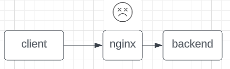

# postmortem

## Issue Summary

From 2:23 AM to 3:25 AM PT, requests to our API were timing out.
client applications that relied on our API were also crippled.
at its peak, the issue affected 100% of traffic to our API and they were unable to use it.
The root cause of this outage was an invalid nginx configuration.

## Timeline (all times Pacific Time)

- 2:22 AM: new nginx docker container pushed.
- 2:23 AM: Outage begins.
- 2:26 AM: users began submitting complaints.
- 2:30 AM: debugging of configuration begins.
- 3:00 AM: configuration problem fixed.
- 3:25 AM: servers back online.

## Root Cause

At 2:23 AM, the nginx configuration was updated to include a new location block without testing it locally. The change had an error in the syntax of the location block which cause nginx to fail on startup, which cause all functions that needed the nginx server to run to fail.

## Resolution and recovery

at 2:26 the users alerted our team which investigated and quickly began debugging the issue at 2:30 AM. By 3:00 AM, our team identified that the issue was a syntax error in the nginx configuration. after fixing the error in the syntax we started uploading the new fixed docker container. At 3:25 AM, the servers were back online and all users were able to use the API.

## Corrective and Preventative Measures

In the last few weeks, we have implemented several measures to prevent this issue from happening again:

- add a testing environment to check if the server that is uploaded will function as expected
- add a possibility to rollback changes
- improve monitoring so that users aren't our main monitor.
- add a way to alert users that the error is in our infrastructure.
